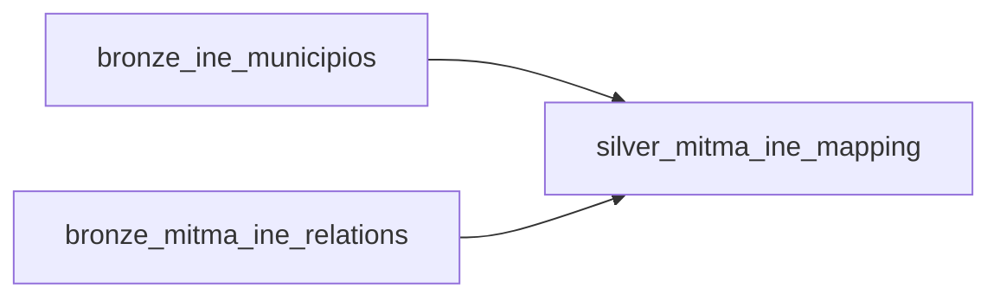
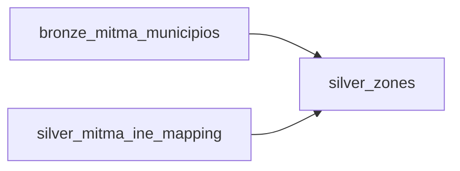
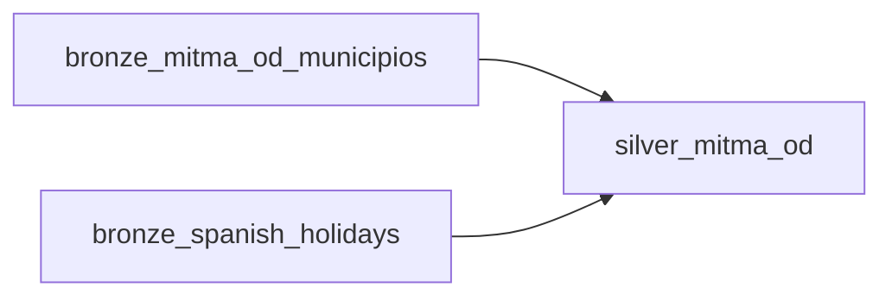
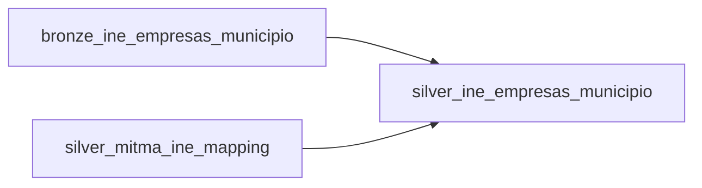
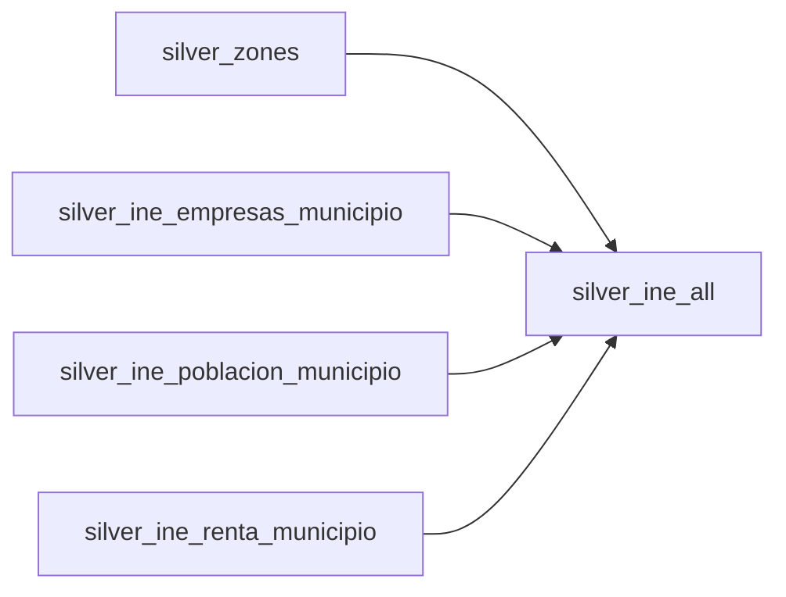

# 🚀 Pipeline de Datos MITMA + INE - Modelo de Gravedad

Pipeline de ingesta, transformación y análisis de datos de movilidad (MITMA) e indicadores socioeconómicos (INE) para la identificación de déficits de infraestructura de transporte en España mediante un modelo de gravedad.

## 📑 Índice

- [Arquitectura General](#-arquitectura-general)
- [Fuentes de Datos (DataSources)](#-fuentes-de-datos-datasources)
- [Arquitectura Medallion (Bronze → Silver → Gold)](#-arquitectura-medallion-bronze--silver--gold)
- [Infraestructura Tecnológica](#-infraestructura-tecnológica)
- [DAGs de Airflow](#-dags-de-airflow)
- [Tablas y Transformaciones](#-tablas-y-transformaciones)
- [Sistema de Tracking de Procesamiento](#-sistema-de-tracking-de-procesamiento)
- [Google Cloud Run Jobs](#-google-cloud-run-jobs)
- [Modelo de Gravedad (Gold Layer)](#-modelo-de-gravedad-gold-layer)

---

## 🏗 Arquitectura General

```
┌─────────────────────────────────────────────────────────────────────────────────┐
│                              FUENTES EXTERNAS                                    │
├──────────────────────┬──────────────────────┬───────────────────────────────────┤
│      MITMA RSS       │       INE API        │        Python Library             │
│  (movilidad.mitma)   │   (servicios.ine)    │       (holidays)                  │
└──────────────────────┴──────────────────────┴───────────────────────────────────┘
                                    │
                                    ▼
┌─────────────────────────────────────────────────────────────────────────────────┐
│                              AIRFLOW DAGS                                        │
│  ┌─────────────────┐  ┌─────────────────┐  ┌─────────────────────────────────┐  │
│  │  bronze_mitma   │  │   bronze_ine    │  │       bronze_holidays           │  │
│  │  (OD, People,   │  │  (Municipios,   │  │   (Festivos nacionales)         │  │
│  │   Overnights,   │  │   Empresas,     │  └─────────────────────────────────┘  │
│  │   Zonification) │  │   Población,    │                                       │
│  └─────────────────┘  │   Renta)        │                                       │
│                       └─────────────────┘                                       │
└─────────────────────────────────────────────────────────────────────────────────┘
                                    │
                    ┌───────────────┴───────────────┐
                    ▼                               ▼
┌───────────────────────────────┐    ┌──────────────────────────────────────────┐
│         RustFS S3             │    │            DuckLake                       │
│   (Almacenamiento temporal)   │    │   (PostgreSQL metadata + S3 data files)  │
│   - mitma-raw bucket          │    │   - Tablas Bronze, Silver, Gold          │
│   - Archivos .csv.gz          │    │   - Particionado por fecha               │
└───────────────────────────────┘    └──────────────────────────────────────────┘
                                                     │
                                                     ▼
┌─────────────────────────────────────────────────────────────────────────────────┐
│                           GOOGLE CLOUD RUN JOBS                                  │
│  ┌─────────────────────────────┐  ┌─────────────────────────────────────────┐   │
│  │   ingestor_cloud            │  │        executor_cloud                    │   │
│  │   (MERGE CSV → DuckLake)    │  │   (Ejecuta SQL arbitrario)               │   │
│  │   - 32GB RAM, 8 CPUs        │  │   - Transformaciones Silver/Gold         │   │
│  └─────────────────────────────┘  └─────────────────────────────────────────┘   │
└─────────────────────────────────────────────────────────────────────────────────┘
```

---

## 📊 Fuentes de Datos (DataSources)

### 1. MITMA (Ministerio de Transportes, Movilidad y Agenda Urbana)

**Origen:** RSS Feed `https://movilidad-opendata.mitma.es/RSS.xml`

El portal de datos abiertos de movilidad del MITMA proporciona datos de movilidad basados en datos de telefonía móvil anonimizados.

| Dataset | Descripción | Formato | Frecuencia |
|---------|-------------|---------|------------|
| **OD (Viajes)** | Matrices Origen-Destino con nº de viajes entre zonas | CSV.GZ | Diario |
| **People Day** | Personas por día según zona de pernoctación | CSV.GZ | Diario |
| **Overnight Stay** | Pernoctaciones por zona residencia/pernoctación | CSV.GZ | Diario |
| **Zonification** | Geometrías + metadatos de zonas (SHP + CSV) | SHP/CSV | Estático |

**Tipos de zonificación soportados:**
- `municipios`: Zonas a nivel municipal (~8,131 zonas)
- `distritos`: Zonas a nivel de distrito censal
- `gau`: Grandes Áreas Urbanas

**Ejemplo de URL de datos OD:**
```
https://movilidad-opendata.mitma.es/estudios_basicos/por-municipios/viajes/ficheros-diarios/2023-03/20230306_Viajes_municipios.csv.gz
```

### 2. INE (Instituto Nacional de Estadística)

**Origen:** API JSON `https://servicios.ine.es/wstempus/js/ES/`

| Dataset | URL Base | Descripción |
|---------|----------|-------------|
| **Municipios** | `VALORES_VARIABLE/19` | Catálogo de municipios con códigos INE |
| **Empresas** | `DATOS_TABLA/3955?tip=AM` | Nº de empresas por municipio y año |
| **Población** | `DATOS_TABLA/2852?tip=AM` | Población por municipio, sexo y año |
| **Renta** | `DATOS_TABLA/31097?tip=AM` | Renta per cápita por municipio |

**Ejemplo de respuesta JSON (Municipios):**
```json
[
  {
    "Id": 28079,
    "Codigo": "28079",
    "Nombre": "Madrid"
  },
  ...
]
```

### 3. MITMA-INE Relations

**Origen:** `https://movilidad-opendata.mitma.es/` (CSV)

Tabla de correspondencia entre códigos MITMA y códigos INE para poder cruzar ambas fuentes de datos.

| Campo | Descripción |
|-------|-------------|
| `municipio_mitma` | ID de zona MITMA |
| `municipio_ine` | Código INE del municipio |

### 4. Festivos Españoles (Holidays)

**Origen:** Librería Python `holidays`

Se genera programáticamente la lista de festivos nacionales españoles para el año solicitado. Se usa para enriquecer los datos de movilidad con flags `is_holiday`.

---

## 🏅 Arquitectura Medallion (Bronze → Silver → Gold)

### Bronze Layer (Raw Data)
- Datos en formato original (CSV/JSON)
- Schema flexible (`all_varchar = true`)
- Metadatos de auditoría (`loaded_at`, `source_file`/`source_url`)
- Sin transformaciones de negocio

### Silver Layer (Cleaned & Enriched)
- Tipos de datos correctos (TIMESTAMP, DOUBLE, etc.)
- Filtros de calidad (nulls, valores inválidos)
- Enriquecimiento con flags calculados
- Deduplicación
- Normalización de nombres e IDs

### Gold Layer (Analytics)
- Tablas optimizadas para análisis
- Métricas agregadas
- Modelo de gravedad calibrado
- Exports para visualización

---

## 🔧 Infraestructura Tecnológica

### Stack Principal

| Componente | Tecnología | Propósito |
|------------|------------|-----------|
| **Orquestador** | Apache Airflow 3.x | Scheduling y gestión de DAGs |
| **Data Lakehouse** | DuckLake | Motor analítico sobre S3 con metadata en PostgreSQL |
| **Object Storage** | RustFS (S3-compatible) | Almacenamiento de archivos de datos |
| **Metadata Store** | PostgreSQL | Catálogo de tablas DuckLake |
| **Compute (Cloud)** | Google Cloud Run Jobs | Ejecución de cargas pesadas |

### Conexiones de Airflow

```yaml
# Conexión S3 (RustFS)
rustfs_s3_conn:
  conn_type: aws
  extra:
    endpoint_url: http://rustfs:9000
    aws_access_key_id: admin
    aws_secret_access_key: ********

# Conexión PostgreSQL (DuckLake metadata)
postgres_datos_externos:
  conn_type: postgres
  host: postgres
  port: 5432
  schema: ducklake_db
  login: airflow
  password: ********

# Conexión Google Cloud (para Cloud Run)
google_cloud_default:
  conn_type: google_cloud_platform
  project_id: muceim-bigdata
  keyfile_json: {...}
```

### Variables de Airflow

```yaml
RUSTFS_BUCKET: "mitma"
GCP_PROJECT_ID: "muceim-bigdata"
GCP_CLOUD_RUN_REGION: "europe-southwest1"
GCP_CLOUD_RUN_JOB_NAME: "insert-ducklake"
GCP_CLOUD_RUN_EXECUTOR_JOB_NAME: "ducklake-executor"
```

---

## 📋 DAGs de Airflow

### 1. `bronze_mitma` - Ingesta de datos MITMA

**Schedule:** Manual (`schedule=None`)  
**Tags:** `bronze`, `mitma`, `data-ingestion`

**Parámetros:**
| Param | Tipo | Descripción |
|-------|------|-------------|
| `start` | string | Fecha inicio (YYYY-MM-DD) |
| `end` | string | Fecha fin (YYYY-MM-DD) |
| `enable_people_day` | boolean | Habilitar ingesta People Day |
| `enable_overnight` | boolean | Habilitar ingesta Overnight |

**TaskGroups:**
```
infra ─► od_municipios ─► done
     ├─► people_day_municipios ─► done
     ├─► overnight_municipios ─► done
     └─► zonification ─► done
```

**Flujo de cada TaskGroup (ej: OD):**
1. `od_urls`: Obtiene URLs del RSS para el rango de fechas
2. `od_filter_urls`: Filtra URLs ya procesadas (consulta `source_file` en tabla)
3. `check_urls`: Branch - si hay URLs procesa, si no salta
4. `od_create`: Crea tabla Bronze si no existe
5. `od_process`: **Dynamic Task Mapping** - procesa cada URL en paralelo:
   - Descarga archivo desde MITMA
   - Sube a RustFS (bucket `mitma-raw`)
   - Ejecuta Cloud Run Job para MERGE en DuckLake
   - Elimina archivo temporal de RustFS

### 2. `bronze_ine` - Ingesta de datos INE

**Schedule:** Manual (`schedule=None`)  
**Tags:** `bronze`, `ine`, `data-ingestion`

**Parámetros:**
| Param | Tipo | Descripción |
|-------|------|-------------|
| `year` | string | Año de datos (YYYY) |

**TaskGroups:**
```
infra ─► municipios ─► done
     ├─► empresas ─► done
     ├─► poblacion ─► done
     ├─► renta ─► done
     └─► mitma_ine_relations ─► done
```

### 3. `bronze_holidays` - Ingesta de festivos

**Schedule:** Manual (`schedule=None`)  
**Tags:** `bronze`, `holidays`, `data-ingestion`

**Parámetros:**
| Param | Tipo | Descripción |
|-------|------|-------------|
| `year` | integer | Año de festivos |

### 4. `silver` - Transformaciones Silver Layer

**Schedule:** Dataset-triggered (espera a los 3 Bronze DAGs)  
**Tags:** `silver`, `data-transformation`

```python
schedule=[
    Dataset("bronze://mitma/done"), 
    Dataset("bronze://ine/done"), 
    Dataset("bronze://holidays/done")
]
```

**Tasks:**
```
start ─► mitma_ine_mapping ─► zonification ─► distances
                          └─► ine_group ─► silver_ine_all
     ├─► overnight_stay ─► done
     ├─► people_day ─► done
     └─► mitma_od_batches ─► od_quality_batches ─► done
```

### 5. `gold_gravity_model` - Análisis Modelo de Gravedad

**Schedule:** Manual (`schedule=None`)  
**Tags:** `gold`, `analytics`, `gravity-model`

**Parámetros:**
| Param | Tipo | Descripción |
|-------|------|-------------|
| `start_date` | date | Inicio período análisis |
| `end_date` | date | Fin período análisis |

**Tasks:**
```
start ─► gravity_model ─► export ─► done
              │               │
              ├─ create_base_pairs
              ├─ calibrate_model
              ├─ compute_mismatch
              └─ zone_ranking
                              │
                              ├─ export_parquet
                              └─ export_keplergl
```

---

## 📊 Tablas y Transformaciones

### Bronze Layer Tables

| Tabla | Fuente | Descripción |
|-------|--------|-------------|
| `bronze_mitma_od_municipios` | MITMA RSS | Matrices OD por municipio |
| `bronze_mitma_people_day_municipios` | MITMA RSS | Personas/día por zona |
| `bronze_mitma_overnight_stay_municipios` | MITMA RSS | Pernoctaciones |
| `bronze_mitma_municipios` | MITMA RSS | Zonificación (geometrías) |
| `bronze_ine_municipios` | INE API | Catálogo municipios |
| `bronze_ine_empresas_municipio` | INE API | Empresas por municipio |
| `bronze_ine_poblacion_municipio` | INE API | Población por municipio |
| `bronze_ine_renta_municipio` | INE API | Renta por municipio |
| `bronze_mitma_ine_relations` | MITMA | Mapping MITMA ↔ INE |
| `bronze_spanish_holidays` | Python lib | Festivos nacionales |

### Silver Layer Tables

#### `silver_mitma_ine_mapping`


**Transformaciones:**
- Normalización de nombres: `strip_accents` + `lower` + `trim`
- JOIN por código INE
- Deduplicación con `DISTINCT`
- Filtros de calidad (no nulls)

#### `silver_zones`


**Transformaciones:**
- Geometría: `ST_GeomFromText()` → `ST_Multi()`
- Cálculo de centroide: `ST_Centroid()`
- Filtro por cobertura de mapping

#### `silver_mitma_od`


**Transformaciones:**
- Parse fecha/hora: `strptime(fecha || LPAD(periodo), '%Y%m%d%H')`
- Cast tipos: `viajes → DOUBLE`
- Enriquecimiento: `is_weekend`, `is_holiday`
- Filtros: excluir `origen = 'externo'`
- Agregación: `SUM(viajes) GROUP BY fecha, origen, destino, residencia`

**Particionado:**
```sql
PARTITIONED BY (year(fecha), month(fecha), day(fecha))
```

#### `silver_mitma_distances`


**Transformaciones:**
- Cross join de todas las zonas
- Distancia esférica: `ST_Distance_Sphere(o.centroid, d.centroid) / 1000`
- Filtro pares únicos: `WHERE o.id < d.id`

#### `silver_ine_empresas_municipio`


**Transformaciones:**
- Explosión de arrays: `UNNEST(Data)`
- Normalización de nombres para matching
- Join fuzzy por nombre: `ILIKE`
- Agregación: `SUM(valor) GROUP BY zone_id`

#### `silver_ine_poblacion_municipio`

**Transformaciones similares a empresas, con:**
- Pivot: `tipo = 'total' | 'hombres' | 'mujeres'`
- Columnas resultado: `poblacion_total`, `poblacion_hombres`, `poblacion_mujeres`

#### `silver_ine_renta_municipio`

**Transformaciones:**
- Filtro semántico: `tipo = 'renta neta media por persona'`
- Agregación: `AVG(valor) → renta_media`

#### `silver_ine_all`


**Tabla consolidada** con todos los indicadores INE por zona MITMA.

---

## 🔄 Sistema de Tracking de Procesamiento

Para garantizar **idempotencia** y evitar reprocesamiento, se implementa un sistema de tracking mediante tablas intermedias.

### Tabla `silver_mitma_od_processed_dates`

```sql
CREATE TABLE silver_mitma_od_processed_dates (
    fecha VARCHAR  -- Formato: 'YYYYMMDD'
);
```

**Flujo:**

1. **Obtener fechas no procesadas:**
```sql
SELECT DISTINCT b.fecha
FROM bronze_mitma_od_municipios b
WHERE CAST(b.fecha AS VARCHAR) NOT IN (
    SELECT fecha FROM silver_mitma_od_processed_dates
)
```

2. **Procesar batch de fechas:**
```sql
INSERT INTO silver_mitma_od ...
WHERE fecha IN ('20230301', '20230302', ...)
```

3. **Registrar fechas procesadas:**
```sql
MERGE INTO silver_mitma_od_processed_dates AS target
USING (VALUES ('20230301'), ('20230302'), ...) AS source(fecha)
ON target.fecha = source.fecha
WHEN NOT MATCHED THEN INSERT (fecha) VALUES (source.fecha);
```

### Tracking en Bronze Layer

Para tablas Bronze, el tracking se hace mediante la columna `source_file` (CSV) o `source_url` (JSON):

```python
def _filter_csv_urls(table_name: str, urls: list[str]):
    """Filtra URLs ya ingestadas consultando source_file."""
    
    ingested_df = con.execute(f"""
        SELECT DISTINCT source_file 
        FROM {table_name}
        WHERE source_file IN ({url_list})
    """).fetchdf()
    
    ingested_urls = set(ingested_df['source_file'].tolist())
    new_urls = [url for url in urls if url not in ingested_urls]
    
    return new_urls
```

Esto permite:
- **Re-ejecutar DAGs** sin duplicar datos
- **Procesar incrementalmente** solo datos nuevos
- **Recuperación de fallos** - continuar desde donde se quedó

---

## ☁️ Google Cloud Run Jobs

Para procesar grandes volúmenes de datos, las tareas pesadas se ejecutan en **Google Cloud Run Jobs** con recursos dedicados (32GB RAM, 8 CPUs).

### Arquitectura

```
┌─────────────────────────────────────────────────────────────────────┐
│                         AIRFLOW WORKER                               │
│                                                                      │
│  1. Descarga archivo desde MITMA                                     │
│  2. Sube archivo a RustFS (s3://mitma-raw/od/municipios/...)        │
│  3. Invoca Cloud Run Job con parámetros                              │
│  4. Espera resultado (polling)                                       │
│  5. Elimina archivo temporal de RustFS                               │
└─────────────────────────────────────────────────────────────────────┘
                              │
                              ▼
┌─────────────────────────────────────────────────────────────────────┐
│                      CLOUD RUN JOB                                   │
│                  (32GB RAM, 8 CPUs)                                  │
│                                                                      │
│  1. Conecta a DuckLake (PostgreSQL + RustFS)                         │
│  2. Lee CSV desde RustFS S3                                          │
│  3. Ejecuta MERGE INTO para insertar/actualizar                      │
│  4. Cierra conexión y termina                                        │
└─────────────────────────────────────────────────────────────────────┘
```

### Job: `ingestor_cloud` (MERGE CSV)

**Entrada (env vars):**
- `TABLE_NAME`: Nombre de la tabla destino (ej: `bronze_mitma_od_municipios`)
- `URL`: Ruta S3 del archivo (ej: `s3://mitma-raw/od/municipios/20230306_Viajes_municipios.csv.gz`)
- `ORIGINAL_URL`: URL original para auditoría

**Código principal:**
```python
def main():
    table_name = os.environ.get("TABLE_NAME")
    s3_path = os.environ.get("URL")
    
    con = get_ducklake_connection(duckdb_config={
        'memory_limit': '28GB',
        'threads': 8,
        'worker_threads': 8,
    })
    
    # Leer CSV y hacer MERGE
    con.execute(f"""
        MERGE INTO {table_name} AS target
        USING (
            SELECT *, CURRENT_TIMESTAMP AS loaded_at, '{s3_path}' AS source_file
            FROM read_csv('{s3_path}', all_varchar=true)
        ) AS source
        ON {merge_condition}
        WHEN NOT MATCHED THEN INSERT *;
    """)
```

### Job: `executor_cloud` (SQL Executor)

**Entrada (env vars):**
- `SQL_QUERY`: Consulta SQL a ejecutar (puede ser multi-statement)

**Uso:**
```python
from utils.gcp import execute_sql_or_cloud_run

result = execute_sql_or_cloud_run(sql_query="""
    CREATE OR REPLACE TABLE silver_mitma_od AS ...
""")
```

### Fallback Local

Si Cloud Run no está configurado, las mismas operaciones se ejecutan localmente en el worker de Airflow:

```python
def execute_sql_or_cloud_run(sql_query: str, **context):
    if _get_cloud_run_connection():
        return exec_gcp_ducklake_executor(sql_query=sql_query)
    else:
        # Ejecutar localmente
        con = get_ducklake_connection()
        con.execute(sql_query)
```

---

## 📈 Modelo de Gravedad (Gold Layer)

### Pregunta de Negocio

> **¿Dónde está más deficitaria la infraestructura de transporte?**

El modelo de gravedad estima la demanda potencial de viajes entre zonas basándose en:
- Población en origen (genera viajes)
- Actividad económica en destino (atrae viajes)
- Distancia (fricción)

### Fórmula del Modelo

```
T_ij = k × (P_i × E_j) / d_ij²
```

Donde:
- `T_ij`: Viajes estimados entre zona i y zona j
- `P_i`: Población en zona origen
- `E_j`: Empresas en zona destino
- `d_ij`: Distancia entre centroides (km)
- `k`: Constante de calibración

### Tablas Gold

#### `gold_gravity_base_pairs`
Todos los pares O-D con sus características:
- Distancias entre centroides
- Población origen/destino
- Empresas origen/destino
- Renta media origen/destino
- Viajes reales agregados
- Días observados

#### `gold_gravity_calibrated`
Modelo calibrado con constante k:
```sql
k = SUM(viajes_reales) / SUM(T_raw)
T_estimado = k × (P_i × E_j) / d_ij²
```

#### `gold_gravity_mismatch`
Ratio de desajuste por par O-D:
```sql
mismatch_ratio = T_estimado / (viajes_reales + 1)
unmet_demand = T_estimado - viajes_reales
```

- `mismatch_ratio > 1`: Demanda potencial mayor que real → **déficit de infraestructura**
- `mismatch_ratio < 1`: Demanda real mayor que estimada → infraestructura suficiente

#### `gold_gravity_zone_ranking`
Métricas agregadas por zona:
```sql
SELECT 
    zone_id,
    AVG(mismatch_ratio) AS avg_mismatch,
    SUM(unmet_demand) AS total_unmet_demand,
    COUNT(*) AS num_corridors_deficit
GROUP BY zone_id
ORDER BY total_unmet_demand DESC
```

### Outputs para Visualización

| Archivo | Formato | Descripción |
|---------|---------|-------------|
| `keplergl_dashboard_*.html` | HTML | Dashboard interactivo con mapas |
| `zones_*.geojson` | GeoJSON | Polígonos de zonas coloreados por déficit |
| `corridors_*.geojson` | GeoJSON | Líneas O-D con grosor por demanda |
| `*.parquet` | Parquet | Datos raw para BI tools |

---

## 🚦 Ejecución del Pipeline

### 1. Ingesta Bronze (en paralelo)

```bash
# Trigger MITMA para marzo 2023
airflow dags trigger bronze_mitma \
  --conf '{"start": "2023-03-01", "end": "2023-03-31", "enable_people_day": false, "enable_overnight": false}'

# Trigger INE para 2023
airflow dags trigger bronze_ine \
  --conf '{"year": "2023"}'

# Trigger Holidays para 2023
airflow dags trigger bronze_holidays \
  --conf '{"year": 2023}'
```

### 2. Transformación Silver

Se dispara automáticamente cuando los 3 Bronze DAGs completan (Airflow Datasets).

### 3. Análisis Gold

```bash
airflow dags trigger gold_gravity_model \
  --conf '{"start_date": "2023-03-01", "end_date": "2023-03-31"}'
```

---

## 🐛 Bugs Conocidos

### DuckLake + MERGE INTO + Particionado con funciones

**Problema:** Al usar `MERGE INTO` con tablas particionadas por funciones `year(fecha)`, `month(fecha)`, `day(fecha)`, se generan valores de partición incorrectos.

**Solución:** Usar `INSERT INTO` en lugar de `MERGE INTO` para `silver_mitma_od`. El tracking de fechas procesadas garantiza idempotencia.

```sql
-- ✅ FUNCIONA
INSERT INTO silver_mitma_od ...
ALTER TABLE silver_mitma_od SET PARTITIONED BY (year(fecha), month(fecha), day(fecha));

-- ❌ NO FUNCIONA (genera particiones corruptas)
MERGE INTO silver_mitma_od ... 
-- Produce: year=-1977503543602676920 en lugar de year=2023
```

---

## 📁 Estructura del Proyecto

```
airflow/
├── dags/
│   ├── bronze/
│   │   ├── bronze_mitma_dag.py      # DAG principal MITMA
│   │   ├── bronze_ine_dag.py        # DAG principal INE
│   │   ├── bronze_holidays_dag.py   # DAG festivos
│   │   ├── tasks/
│   │   │   ├── mitma/               # Tasks MITMA (OD, People, Overnight, Zonification)
│   │   │   ├── ine/                 # Tasks INE (Municipios, Empresas, Población, Renta)
│   │   │   └── holidays/            # Tasks festivos
│   │   └── utils.py                 # Utilidades Bronze (URLs, merge, filter)
│   │
│   ├── silver/
│   │   ├── silver_dag.py            # DAG principal Silver
│   │   ├── mitma/                   # Tasks Silver MITMA
│   │   ├── ine/                     # Tasks Silver INE
│   │   └── misc/                    # Quality checks, cleanup
│   │
│   ├── gold/
│   │   ├── gold_gravity_model_dag.py  # DAG modelo de gravedad
│   │   └── tasks/gravity_model/       # Tasks del modelo
│   │
│   ├── misc/
│   │   └── infra.py                 # TaskGroup infraestructura
│   │
│   └── utils/
│       ├── utils.py                 # DuckLake connection manager
│       └── gcp.py                   # Google Cloud Run utilities
│
├── gcp/
│   ├── ingestor_cloud/              # Cloud Run Job para MERGE CSV
│   └── executor_cloud/              # Cloud Run Job para SQL
│
├── docs/
│   └── bronze_to_silver_transformations.md  # Documentación transformaciones
│
└── requirements.txt                 # Dependencias Python
```

---

## 📝 Licencia

Este proyecto fue desarrollado como parte del Máster en Ciencia e Ingeniería de Datos (MUCEIM) - Universidad Politécnica de Valencia.

