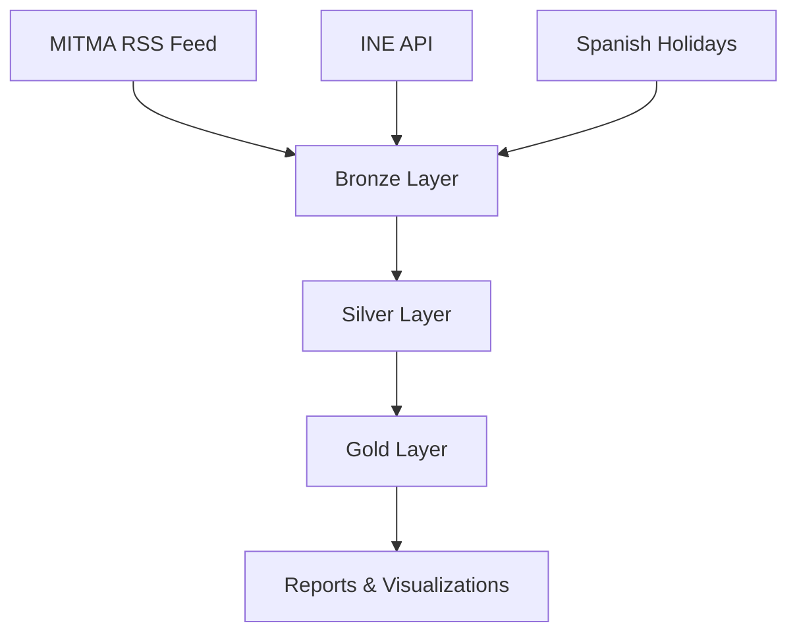
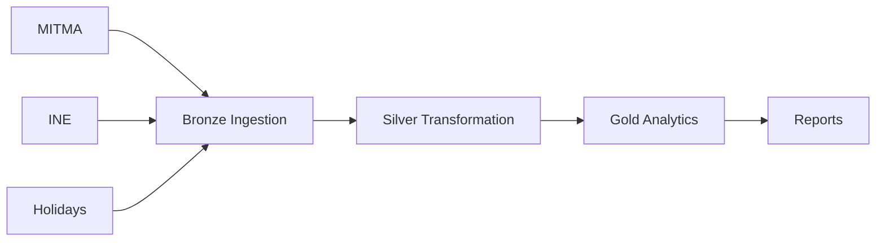

# MITMA + INE Data Pipeline - Gravity Model

Data ingestion, transformation and analysis pipeline for mobility (MITMA) and socioeconomic indicators (INE) to identify transportation infrastructure deficits in Spain using a gravity model.

## Architecture



## Data Sources

### MITMA (Ministry of Transport)
- **Origin**: RSS Feed `https://movilidad-opendata.mitma.es/RSS.xml`
- **Datasets**: OD matrices, People Day, Overnight Stay, Zonification
- **Format**: CSV.GZ
- **Frequency**: Daily

### INE (National Statistics Institute)
- **Origin**: API JSON `https://servicios.ine.es/wstempus/js/ES/`
- **Datasets**: Municipalities, Companies, Population, Income
- **Format**: JSON
- **Frequency**: Annual

## Medallion Architecture

### Bronze Layer (Raw Data)
- Original format (CSV/JSON)
- Flexible schema (`all_varchar = true`)
- Audit metadata (`loaded_at`, `source_file`/`source_url`)
- No business transformations

### Silver Layer (Cleaned & Enriched)
- Correct data types (TIMESTAMP, DOUBLE, etc.)
- Quality filters (nulls, invalid values)
- Enrichment with calculated flags
- Deduplication
- Normalized names and IDs

### Gold Layer (Analytics)
- Optimized tables for analysis
- Aggregated metrics
- Calibrated gravity model
- Exports for visualization

## Technology Stack

| Component | Technology | Purpose |
|-----------|------------|---------|
| Orchestrator | Apache Airflow 3.x | Scheduling and DAG management |
| Data Lakehouse | DuckLake | Analytical engine on S3 with PostgreSQL metadata |
| Object Storage | RustFS (S3-compatible) | Data file storage |
| Metadata Store | PostgreSQL | DuckLake table catalog |
| Compute (Cloud) | Google Cloud Run Jobs | Heavy workload execution |

## DAGs

### Bronze DAGs
- `bronze_mitma`: MITMA data ingestion (OD, People Day, Overnights, Zonification)
- `bronze_ine`: INE data ingestion (Municipalities, Companies, Population, Income)
- `bronze_holidays`: Spanish holidays ingestion

### Silver DAG
- `silver`: Dataset-triggered transformations
  - MITMA-INE mapping
  - Zone processing
  - Distance calculations
  - INE data consolidation

### Gold DAGs
- `gold_tables_dag`: Creates gold layer tables
- `gold_report_question_1_dag`: Typical day analysis
- `gold_report_question_2_dag`: Gravity model analysis
- `gold_report_question_3_dag`: Functional type analysis

## Pipeline Flow



## Key Features

- **Idempotent Processing**: Tracks processed files/dates to avoid duplicates
- **Batch Processing**: Parallel processing with dynamic task mapping
- **Cloud Run Integration**: Heavy operations run on GCP Cloud Run Jobs
- **Partitioned Tables**: Temporal partitioning for query optimization
- **Retry Logic**: Exponential backoff for transient errors

## Configuration

### Airflow Connections
- `rustfs_s3_conn`: S3 connection for RustFS
- `postgres_datos_externos`: PostgreSQL connection for DuckLake metadata
- `google_cloud_default`: GCP connection for Cloud Run

### Airflow Variables
- `RUSTFS_BUCKET`: S3 bucket name (default: "mitma")
- `GCP_PROJECT_ID`: GCP project ID
- `GCP_CLOUD_RUN_REGION`: Cloud Run region
- `GCP_CLOUD_RUN_JOB_NAME`: Cloud Run job name for ingestion
- `GCP_CLOUD_RUN_EXECUTOR_JOB_NAME`: Cloud Run job name for SQL execution

## Usage

### Trigger Bronze Ingestion
```bash
# MITMA data for date range
airflow dags trigger bronze_mitma \
  --conf '{"start": "2023-03-01", "end": "2023-03-31"}'

# INE data for year
airflow dags trigger bronze_ine \
  --conf '{"year": "2023"}'

# Holidays for year
airflow dags trigger bronze_holidays \
  --conf '{"year": 2023}'
```

### Silver Transformation
Automatically triggered when all Bronze DAGs complete (via Airflow Datasets).

### Gold Analytics
```bash
airflow dags trigger gold_tables_dag
airflow dags trigger gold_report_question_2_dag \
  --conf '{"start_date": "2023-03-01", "end_date": "2023-03-31"}'
```

## Project Structure

```
dags/
├── bronze/          # Bronze layer DAGs and tasks
├── silver/          # Silver layer DAGs and tasks
├── gold/            # Gold layer DAGs and tasks
├── misc/            # Infrastructure tasks
└── utils/           # Utility functions (DuckLake, GCP)

gcp/
├── ingestor_cloud/   # Cloud Run job for CSV ingestion
└── executor_cloud/   # Cloud Run job for SQL execution
```

## Unused Functions

The following functions are defined but not currently used:
- `ducklake_connection()`: Context manager for DuckLake connection (use `get_ducklake_connection()` instead)

## License

This project was developed as part of the Master's in Data Science and Engineering (MUCEIM) - Polytechnic University of Valencia.
