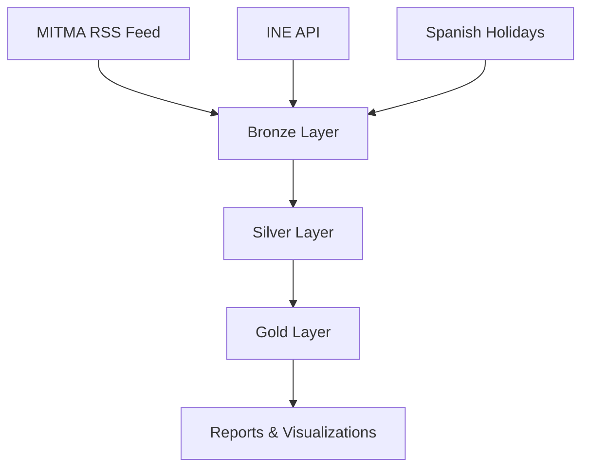
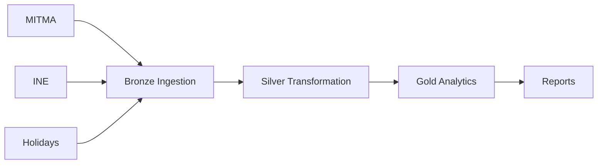

# MITMA + INE Data Pipeline - Gravity Model

Data ingestion, transformation and analysis pipeline for mobility (MITMA) and socioeconomic indicators (INE) to identify transportation infrastructure deficits in Spain using a gravity model.

## Architecture



## Data Sources

### MITMA (Ministry of Transport)
- **Origin**: RSS Feed `https://movilidad-opendata.mitma.es/RSS.xml`
- **Datasets**: OD matrices, People Day, Overnight Stay, Zonification
- **Format**: CSV.GZ
- **Frequency**: Daily

### INE (National Statistics Institute)
- **Origin**: API JSON `https://servicios.ine.es/wstempus/js/ES/`
- **Datasets**: Municipalities, Companies, Population, Income
- **Format**: JSON
- **Frequency**: Annual

## Medallion Architecture

### Bronze Layer (Raw Data)
- Original format (CSV/JSON)
- Flexible schema (`all_varchar = true`)
- Audit metadata (`loaded_at`, `source_file`/`source_url`)
- No business transformations
- **Zone Types**: MITMA data supports multiple zone types:
  - `municipios`: Municipality-level data
  - `distritos`: District-level data
  - `gau`: GAU (Geographic Analysis Unit) level data
- **Batch Processing**: OD data is processed in configurable batches for parallel processing
- **Idempotent Checks**: Automatically skips already-processed files/dates based on source tracking

#### Bronze Tables
**MITMA Tables:**
- `bronze_mitma_od_{zone_type}`: Origin-destination matrices (partitioned by date)
- `bronze_mitma_{zone_type}`: Zonification data (geographic boundaries, names, population)
- `bronze_mitma_ine_relations`: Mapping between MITMA and INE identifiers

**INE Tables:**
- `bronze_ine_municipios`: Municipality reference data
- `bronze_ine_empresas_municipio`: Company data by municipality
- `bronze_ine_poblacion_municipio`: Population data by municipality
- `bronze_ine_renta_municipio`: Income data by municipality

**Holidays Tables:**
- `bronze_spanish_holidays`: Spanish public holidays

### Silver Layer (Cleaned & Enriched)
- Correct data types (TIMESTAMP, DOUBLE, etc.)
- Quality filters (nulls, invalid values)
- Enrichment with calculated flags
- Deduplication
- Normalized names and IDs

### Gold Layer (Analytics)
- Optimized tables for analysis
- Aggregated metrics
- Calibrated gravity model
- Exports for visualization

## Technology Stack

| Component | Technology | Purpose |
|-----------|------------|---------|
| Orchestrator | Apache Airflow 3.x | Scheduling and DAG management |
| Data Lakehouse | DuckLake | Analytical engine on S3 with PostgreSQL metadata |
| Object Storage | RustFS (S3-compatible) | Data file storage |
| Metadata Store | PostgreSQL | DuckLake table catalog |
| Compute (Cloud) | Google Cloud Run Jobs | Heavy workload execution |

## DAGs

### Bronze DAGs
- `bronze_mitma`: MITMA data ingestion (OD matrices, Zonification, MITMA-INE Relations)
  - Supports zone types: `municipios`, `distritos`, `gau`
  - Batch processing with configurable batch size
  - Processes OD data by date range with idempotent checks
- `bronze_ine`: INE data ingestion (Municipalities, Companies, Population, Income)
- `bronze_holidays`: Spanish holidays ingestion
- `bronze_mitma_checker`: Daily scheduled DAG that checks for new MITMA OD URLs and automatically triggers `bronze_mitma` if data is available
  - ⚠️ **Current Limitation**: Currently only checks for the current execution date. The ideal implementation would query the last ingested date in Bronze, create a date range from that point to today, and process all missing dates. However, due to limited resources in the RustFS deployment, the current implementation processes only the current day. This gap-filling functionality should be implemented as a next step.
- `bronze_cleanup`: Maintenance DAG for cleaning Bronze layer data (RustFS files and/or tables)

### Silver DAG
- `silver`: Dataset-triggered transformations
  - MITMA-INE mapping
  - Zone processing
  - Distance calculations
  - INE data consolidation

### Gold DAGs
- `gold_tables_dag`: Creates gold layer tables. Automatically triggered via Airflow Datasets when Silver layer completes.
- `gold_report_question_1_dag`: Typical day analysis
- `gold_report_question_2_dag`: Gravity model analysis
- `gold_report_question_3_dag`: Functional type analysis

## Pipeline Flow



## Key Features

- **Idempotent Processing**: All queries and operations are idempotent. The system tracks processed files/dates to avoid duplicates, and can be safely re-run without side effects. This includes:
  - Bronze ingestion checks for existing `source_file`/`source_url` before processing
  - Silver transformations use `INSERT OR REPLACE` and `MERGE` statements
  - Gold layer operations are designed to be re-runnable without data corruption
- **Batch Processing**: Parallel processing with dynamic task mapping
- **Cloud Run Integration**: Heavy operations run on GCP Cloud Run Jobs
- **Partitioned Tables**: Temporal partitioning for query optimization
- **Retry Logic**: Exponential backoff for transient errors

## Configuration

### Airflow Connections
- `rustfs_s3_conn`: S3 connection for RustFS
- `postgres_datos_externos`: PostgreSQL connection for DuckLake metadata
- `google_cloud_default`: GCP connection for Cloud Run

### Airflow Variables
- `RUSTFS_BUCKET`: S3 bucket name (default: "mitma")
- `RAW_BUCKET`: S3 bucket name for raw data storage (default: "mitma-raw")
- `GCP_PROJECT_ID`: GCP project ID
- `GCP_CLOUD_RUN_REGION`: Cloud Run region
- `GCP_CLOUD_RUN_JOB_NAME`: Cloud Run job name for ingestion
- `GCP_CLOUD_RUN_EXECUTOR_JOB_NAME`: Cloud Run job name for SQL execution

## Usage

### Trigger Bronze Ingestion
```bash
# MITMA data for date range (with optional batch size)
airflow dags trigger bronze_mitma \
  --conf '{"start": "2023-03-01", "end": "2023-03-31", "batch_size": 2}'

# INE data for year
airflow dags trigger bronze_ine \
  --conf '{"year": "2023"}'

# Holidays for year
airflow dags trigger bronze_holidays \
  --conf '{"year": 2023}'

# Cleanup Bronze layer data (use with caution!)
airflow dags trigger bronze_cleanup \
  --conf '{
    "source": "mitma",
    "cleanup_rustfs": true,
    "cleanup_tables": false,
    "dataset": "all",
    "zone_type": "all"
  }'
```

**Note**: 
- `bronze_mitma_checker` runs automatically daily at 00:00 and will trigger `bronze_mitma` if new data is available
- When `bronze_mitma` is triggered by the checker, it automatically triggers `silver` DAG upon completion

### Silver Transformation
Automatically triggered when all Bronze DAGs complete (via Airflow Datasets). Upon completion, automatically triggers `gold_tables_dag` via Airflow Datasets.

### Gold Analytics
`gold_tables_dag` is automatically triggered when Silver layer completes. For report DAGs, trigger manually:
```bash
airflow dags trigger gold_report_question_2_dag \
  --conf '{"start_date": "2023-03-01", "end_date": "2023-03-31"}'
```

## Project Structure

```
dags/
├── bronze/          # Bronze layer DAGs and tasks
│   ├── tasks/       # Task modules organized by source
│   │   ├── mitma/   # MITMA tasks (OD, Zonification, INE Relations)
│   │   ├── ine/     # INE tasks (Municipalities, Companies, Population, Income)
│   │   └── holidays/# Holidays tasks
│   ├── bronze_mitma_dag.py
│   ├── bronze_ine_dag.py
│   ├── bronze_holidays_dag.py
│   ├── bronze_mitma_checker_dag.py
│   ├── bronze_cleanup_dag.py
│   └── utils.py     # Bronze layer utilities
├── silver/          # Silver layer DAGs and tasks
├── gold/            # Gold layer DAGs and tasks
├── misc/            # Infrastructure tasks
└── utils/           # Utility functions (DuckLake, GCP)

gcp/
├── ingestor_cloud/   # Cloud Run job for CSV ingestion
└── executor_cloud/   # Cloud Run job for SQL execution
```

## License

This project was developed as part of the Master's in Data Science and Engineering (MUCEIM) - Polytechnic University of Valencia.
