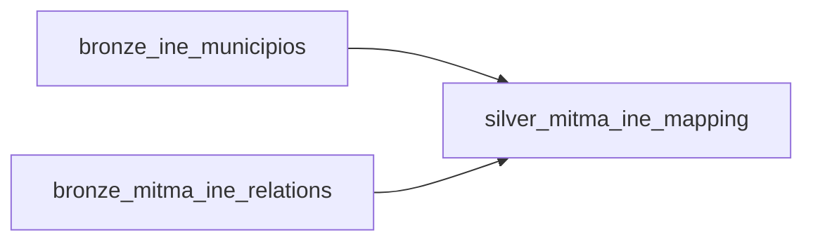
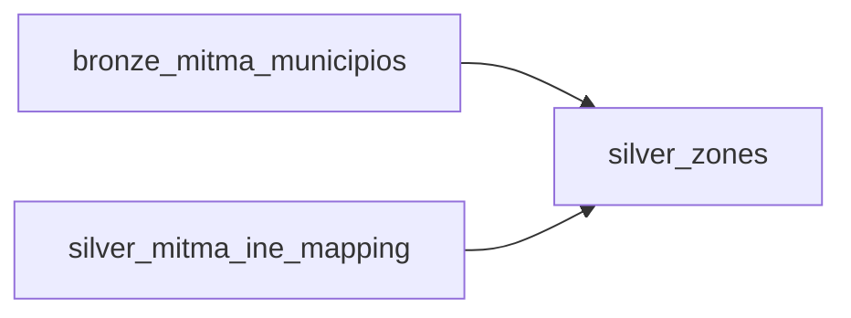
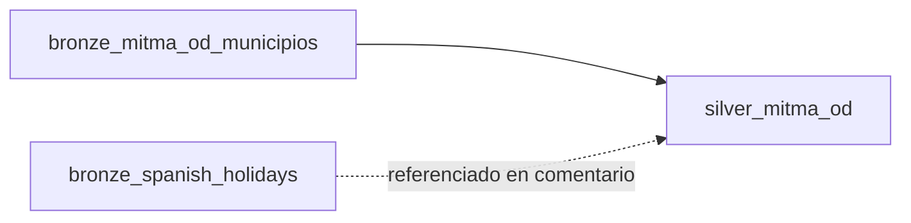
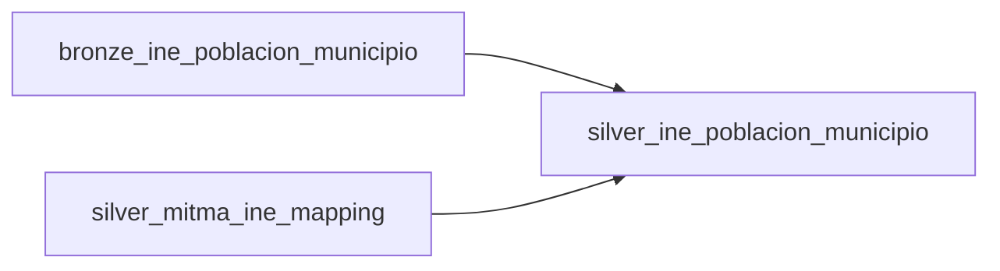
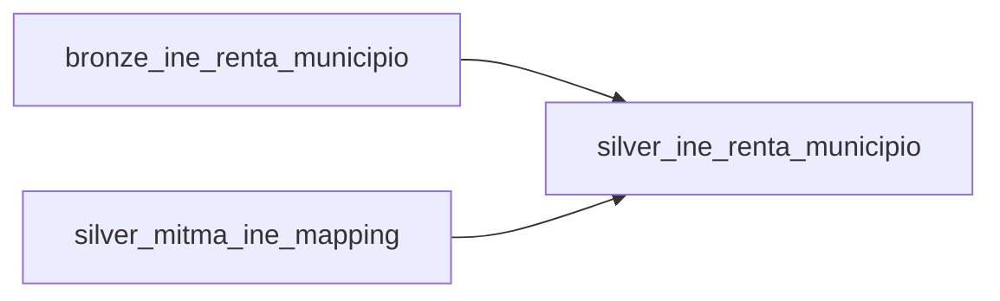
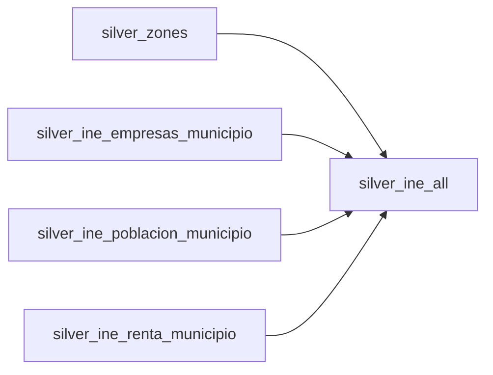

# Lineage Bronze → Silver (1 Mermaid por tabla)

Este documento muestra **la trazabilidad (lineage)** y **las transformaciones SQL** que se aplican para construir cada tabla en la **Silver layer** a partir de Bronze (y, en algunos casos, de otras tablas Silver).

> Nota: los diagramas representan dependencias de datos (inputs/outputs), no el orden de ejecución exacto en Airflow.

## `silver_mitma_ine_mapping`



- **Inputs**: `bronze_ine_municipios`, `bronze_mitma_ine_relations`
- **Transformaciones**:
  - **Normalización del nombre** (para matchear): `strip_accents` + `lower` + `trim` + `replace('-', ' ')` + parsing con `split_part(...)` y `coalesce(...)`.
  - **Join** por código: `bronze_ine_municipios.Codigo = bronze_mitma_ine_relations.municipio_ine`.
  - **Filtros de calidad**: elimina filas con `municipio_mitma` / `Codigo` / `nombre` nulos.
  - **Deduplicación**: `SELECT DISTINCT`.
- **Output**: tabla clave para mapear INE ↔ MITMA (se usa en varias tablas Silver posteriores).

- **Atributos (columnas)**:
  - `nombre` (VARCHAR): nombre normalizado del municipio (para matching).
  - `codigo_ine` (VARCHAR/INT): código INE del municipio.
  - `municipio_mitma` (VARCHAR/INT): id MITMA del municipio/zona.

- **Ejemplo (2–3 registros, ilustrativo)**:

| nombre | codigo_ine | municipio_mitma |
|---|---:|---:|
| madrid | 28079 | 28079 |
| barcelona | 08019 | 8019 |
| valencia | 46250 | 46250 |

## `silver_zones`



- **Inputs**: `bronze_mitma_municipios`, `silver_mitma_ine_mapping`
- **Transformaciones**:
  - **Geometría**: `ST_GeomFromText(geometry)` → `ST_Multi(...)` para unificar a multipolígonos.
  - **Centroide**: `ST_Centroid(geometry_obj)` para permitir cálculos posteriores (distancias).
  - **Filtros de calidad**: `id`, `nombre`, `geometry_obj` no nulos.
  - **Filtro por cobertura de mapping**: `LEFT JOIN silver_mitma_ine_mapping` por `id = municipio_mitma` y se queda con los que tienen mapping (`WHERE s.municipio_mitma IS NOT NULL`).
  - **Deduplicación**: `SELECT DISTINCT`.

- **Atributos (columnas)**:
  - `id` (VARCHAR/INT): identificador de zona (MITMA).
  - `nombre` (VARCHAR): nombre de la zona.
  - `geometry_obj` (GEOMETRY): geometría (multipolígono).
  - `centroid` (GEOMETRY): centroide de la geometría.

- **Ejemplo (2–3 registros, ilustrativo)**:

| id | nombre | geometry_obj | centroid |
|---:|---|---|---|
| 28079 | Madrid | MULTIPOLYGON((...)) | POINT(-3.7038 40.4168) |
| 8019 | Barcelona | MULTIPOLYGON((...)) | POINT(2.1734 41.3851) |
| 46250 | Valencia | MULTIPOLYGON((...)) | POINT(-0.3763 39.4699) |

## `silver_mitma_od`



- **Input**: `bronze_mitma_od_municipios` (y aparece `bronze_spanish_holidays` como dependencia "comentada", pero **en la SQL actual no se usa**)
- **Transformaciones**:
  - **Fecha/hora**: `strptime(fecha::VARCHAR || LPAD(periodo::VARCHAR, 2, '0'), '%Y%m%d%H') AS fecha`.
  - **Renombre de columnas**: `origen`/`destino` → `origen_zone_id`/`destino_zone_id`.
  - **Casts**: `viajes`, `viajes_km` → `DOUBLE`.
  - **Filtros de calidad**:
    - `fecha IS NOT NULL`
    - `origen_zone_id` y `destino_zone_id` no nulos y distintos de `'externo'`
    - `viajes`, `viajes_km`, `distancia`, `residencia` no nulos
  - **Deduplicación**: `SELECT DISTINCT(*)`.

- **Atributos (columnas)**:
  - `fecha` (TIMESTAMP): fecha/hora (derivada de `fecha` + `periodo`).
  - `origen_zone_id` (VARCHAR): id de zona origen (MITMA).
  - `destino_zone_id` (VARCHAR): id de zona destino (MITMA).
  - `viajes` (DOUBLE): número de viajes.
  - `viajes_km` (DOUBLE): viajes ponderados por km (según fuente).
  - `distancia` (VARCHAR/DOUBLE): distancia (según fuente; en Bronze puede venir como texto/num).
  - `residencia` (VARCHAR): categoría de residencia (según fuente).

- **Ejemplo (2–3 registros, ilustrativo)**:

| fecha | origen_zone_id | destino_zone_id | viajes | viajes_km | distancia | residencia |
|---|---:|---:|---:|---:|---:|---|
| 2025-01-10 08:00:00 | 28079 | 8019 | 1234.0 | 4567.8 | 505.0 | residente |
| 2025-01-10 09:00:00 | 8019 | 28079 | 980.0 | 3621.0 | 505.0 | residente |
| 2025-01-11 18:00:00 | 28079 | 46250 | 450.0 | 1590.0 | 302.0 | no_residente |

## `silver_people_day`


- **Input**: `bronze_mitma_people_day_municipios`
- **Transformaciones**:
  - **Fecha**: `strptime(CAST(fecha AS VARCHAR), '%Y%m%d')::DATE AS fecha`.
  - **Casts**: `personas` → `DOUBLE`.
  - **Filtros de calidad**: `fecha`, `zona_pernoctacion`, `edad`, `sexo`, `numero_viajes`, `personas` no nulos.

- **Atributos (columnas)**:
  - `fecha` (DATE): día.
  - `zona_pernoctacion` (VARCHAR/INT): id zona (MITMA) donde pernocta.
  - `edad` (VARCHAR/INT): categoría de edad (según fuente).
  - `sexo` (VARCHAR): sexo (según fuente).
  - `numero_viajes` (VARCHAR/INT): categoría de número de viajes (según fuente).
  - `personas` (DOUBLE): conteo de personas.

- **Ejemplo (2–3 registros, ilustrativo)**:

| fecha | zona_pernoctacion | edad | sexo | numero_viajes | personas |
|---|---:|---|---|---|---:|
| 2025-01-10 | 28079 | 30-44 | H | 1 | 1200.0 |
| 2025-01-10 | 28079 | 30-44 | M | 2 | 980.0 |
| 2025-01-10 | 8019 | 18-29 | M | 1 | 650.0 |

## `silver_overnight_stay`


- **Input**: `bronze_mitma_overnight_stay_municipios`
- **Transformaciones**:
  - **Fecha**: `strptime(CAST(fecha AS VARCHAR), '%Y%m%d')::DATE AS fecha`.
  - **Casts**: `personas` → `DOUBLE`.
  - **Filtros de calidad**: `fecha`, `zona_pernoctacion`, `zona_residencia`, `personas` no nulos.

- **Atributos (columnas)**:
  - `fecha` (DATE): día.
  - `zona_pernoctacion` (VARCHAR/INT): id zona (MITMA) donde pernocta.
  - `zona_residencia` (VARCHAR/INT): id zona (MITMA) de residencia.
  - `personas` (DOUBLE): personas pernoctando.

- **Ejemplo (2–3 registros, ilustrativo)**:

| fecha | zona_pernoctacion | zona_residencia | personas |
|---|---:|---:|---:|
| 2025-01-10 | 28079 | 28079 | 5400.0 |
| 2025-01-10 | 8019 | 28079 | 320.0 |
| 2025-01-11 | 46250 | 8019 | 210.0 |

## `silver_mitma_distances`


- **Input**: `silver_zones` (no viene directo de Bronze)
- **Transformaciones**:
  - **Spatial extension**: `INSTALL spatial; LOAD spatial;`
  - **Cross join**: todas las combinaciones `o × d` de zonas.
  - **Distancia**: `ST_Distance_Sphere(o.centroid, d.centroid) / 1000.0 AS distance_km`.
  - **Pares únicos**: `WHERE o.id < d.id` (evita duplicados y self-pairs).

- **Atributos (columnas)**:
  - `origin` (VARCHAR/INT): id de zona origen.
  - `destination` (VARCHAR/INT): id de zona destino.
  - `distance_km` (DOUBLE): distancia esférica entre centroides (km).

- **Ejemplo (2–3 registros, ilustrativo)**:

| origin | destination | distance_km |
|---:|---:|---:|
| 8019 | 28079 | 505.2 |
| 46250 | 28079 | 302.1 |
| 46250 | 8019 | 303.6 |

## `silver_ine_empresas_municipio`


- **Inputs**: `bronze_ine_empresas_municipio`, `silver_mitma_ine_mapping`
- **Transformaciones**:
  - **Parseo/normalización de nombre** (igual criterio que mapping): `strip_accents` + `lower` + `trim` + `replace('-', ' ')` + parsing con `split_part(...)`.
  - **Explosión del array**: `UNNEST(e.Data)` para sacar cada `Valor`.
  - **Cast y default**: `COALESCE(CAST(valor AS DOUBLE), 0)`.
  - **Join “fuzzy” por nombre**: `ep.nombre ILIKE m.nombre` para mapear a `zone_id = municipio_mitma`.
  - **Agregación**:
    - `MAX(ep.valor)` por (`zone_id`, `ep.nombre`) para quedarte con un valor por municipio-normalizado.
    - `SUM(valor)` por `zone_id` para el total de empresas por zona MITMA.

- **Atributos (columnas)**:
  - `zone_id` (VARCHAR/INT): id de zona (MITMA).
  - `empresas` (DOUBLE): total agregado de empresas para la zona.

- **Ejemplo (2–3 registros, ilustrativo)**:

| zone_id | empresas |
|---:|---:|
| 28079 | 245123.0 |
| 8019 | 198450.0 |
| 46250 | 76210.0 |

## `silver_ine_poblacion_municipio`



- **Inputs**: `bronze_ine_poblacion_municipio`, `silver_mitma_ine_mapping`
- **Transformaciones**:
  - **Parseo/normalización**:
    - `nombre` normalizado como en el resto (strip/lower/accents/replace).
    - `tipo = lower(trim(split_part(Nombre, '.', 2)))` (p.ej. `total`, `hombres`, `mujeres`).
  - **Explosión del array**: `UNNEST(p.Data)` para sacar `Valor`.
  - **Cast y default**: `COALESCE(CAST(valor AS DOUBLE), 0)`.
  - **Join por nombre**: `ep.nombre ILIKE m.nombre` para `zone_id = municipio_mitma`.
  - **Agregación final por `zone_id`**:
    - `SUM(CASE WHEN tipo='total' THEN valor END)` → `poblacion_total`
    - `SUM(CASE WHEN tipo='hombres' THEN valor END)` → `poblacion_hombres`
    - `SUM(CASE WHEN tipo='mujeres' THEN valor END)` → `poblacion_mujeres`

- **Atributos (columnas)**:
  - `zone_id` (VARCHAR/INT): id de zona (MITMA).
  - `poblacion_total` (DOUBLE): población total agregada.
  - `poblacion_hombres` (DOUBLE): población hombres agregada.
  - `poblacion_mujeres` (DOUBLE): población mujeres agregada.

- **Ejemplo (2–3 registros, ilustrativo)**:

| zone_id | poblacion_total | poblacion_hombres | poblacion_mujeres |
|---:|---:|---:|---:|
| 28079 | 3300000.0 | 1560000.0 | 1740000.0 |
| 8019 | 1650000.0 | 790000.0 | 860000.0 |
| 46250 | 800000.0 | 385000.0 | 415000.0 |

## `silver_ine_renta_municipio`



- **Inputs**: `bronze_ine_renta_municipio`, `silver_mitma_ine_mapping`
- **Transformaciones**:
  - **Parseo/normalización** de `nombre` (strip/lower/accents/replace) y extracción de `tipo` con `split_part(Nombre, '.', 3)`.
  - **Explosión del array**: `UNNEST(Data)` para sacar `Valor`.
  - **Filtro semántico**: solo `tipo = 'renta neta media por persona'`.
  - **Filtro de granularidad**: excluye `nombre ILIKE '%sección%'` y `nombre ILIKE '%distrito%'`.
  - **Join por nombre**: `ep.nombre ILIKE m.nombre` para `zone_id = municipio_mitma`.
  - **Selección**: `SELECT DISTINCT ON (m.municipio_mitma)` para priorizar un match por zona.
  - **Agregación final**: `ROUND(AVG(valor), 2)` por (`zone_id`, `tipo`) → `renta_media`.

- **Atributos (columnas)**:
  - `zone_id` (VARCHAR/INT): id de zona (MITMA).
  - `tipo` (VARCHAR): tipo de indicador (aquí, renta filtrada).
  - `renta_media` (DOUBLE): media agregada (redondeada a 2 decimales).

- **Ejemplo (2–3 registros, ilustrativo)**:

| zone_id | tipo | renta_media |
|---:|---|---:|
| 28079 | renta neta media por persona | 17500.25 |
| 8019 | renta neta media por persona | 16210.80 |
| 46250 | renta neta media por persona | 14980.10 |

## `silver_ine_all`



- **Inputs**: `silver_zones` + (`silver_ine_empresas_municipio`, `silver_ine_poblacion_municipio`, `silver_ine_renta_municipio`)
- **Transformaciones**:
  - **Left joins**: une todo por `z.id = *.zone_id`.
  - **Null-safe defaults**: `COALESCE(..., 0)` para empresas, renta y población.
  - **Columna `year`**: se añade como literal a partir de `params.start` del DAG.
  - **Ordenación**: `ORDER BY z.id`.

- **Atributos (columnas)**:
  - `id` (VARCHAR/INT): id de zona (MITMA).
  - `nombre` (VARCHAR): nombre de la zona.
  - `empresas` (DOUBLE): empresas (default 0 si no hay match).
  - `renta_media` (DOUBLE): renta media (default 0).
  - `poblacion_total` (DOUBLE): población total (default 0).
  - `poblacion_hombres` (DOUBLE): población hombres (default 0).
  - `poblacion_mujeres` (DOUBLE): población mujeres (default 0).
  - `year` (VARCHAR): año del proceso (derivado de params).

- **Ejemplo (2–3 registros, ilustrativo)**:

| id | nombre | empresas | renta_media | poblacion_total | poblacion_hombres | poblacion_mujeres | year |
|---:|---|---:|---:|---:|---:|---:|---|
| 28079 | Madrid | 245123.0 | 17500.25 | 3300000.0 | 1560000.0 | 1740000.0 | 2025 |
| 8019 | Barcelona | 198450.0 | 16210.80 | 1650000.0 | 790000.0 | 860000.0 | 2025 |
| 46250 | Valencia | 76210.0 | 14980.10 | 800000.0 | 385000.0 | 415000.0 | 2025 |

## Limpieza de intermedias (post-proceso)

No es "bronze → silver", pero sí parte del pipeline: `CLEANUP_intermediate_ine_tables` hace `DROP TABLE IF EXISTS` de:

- `silver_ine_empresas_municipio`
- `silver_ine_poblacion_municipio`
- `silver_ine_renta_municipio`

---

## Bug conocido: DuckLake + MERGE INTO + Particionado con funciones

### Problema

Al usar DuckLake con tablas particionadas mediante funciones `year()`, `month()`, `day()` combinado con `MERGE INTO`, se generan valores de partición incorrectos (números enormes como `year=1030792151665` en lugar de `year=2023`).

```sql
-- ❌ NO FUNCIONA con MERGE INTO
ALTER TABLE silver_od SET PARTITIONED BY (year(fecha), month(fecha), day(fecha));

-- Luego al hacer MERGE INTO, las particiones salen corruptas:
-- year=-1977503543602676920/
-- year=1030792151665/
```

### Causa

El bug parece estar en cómo DuckLake evalúa las funciones `year()`, `month()`, `day()` durante la operación `MERGE INTO`. En lugar de aplicar las funciones sobre el valor formateado del TIMESTAMP, las aplica sobre la representación interna (microsegundos desde epoch o similar).

### Solución implementada

Se usa `INSERT INTO` en lugar de `MERGE INTO` para las tablas `silver_mitma_od` y `silver_mitma_od_quality`. El particionado con funciones funciona correctamente con `INSERT INTO`.

```sql
-- ✅ FUNCIONA con INSERT INTO
ALTER TABLE silver_mitma_od SET PARTITIONED BY (year(fecha), month(fecha), day(fecha));
ALTER TABLE silver_mitma_od_quality SET PARTITIONED BY (year(fecha), month(fecha), day(fecha));

-- INSERT INTO genera particiones correctas:
-- year=2023/month=3/day=6/
-- year=2023/month=4/day=25/
```

### Alternativas probadas

| Configuración | Funciona? |
|---------------|-----------|
| `MERGE INTO` + `PARTITIONED BY (year(fecha), ...)` | ❌ Bug |
| `INSERT INTO` + `PARTITIONED BY (year(fecha), ...)` | ✅ Sí |
| `MERGE INTO` + `PARTITIONED BY (fecha)` (identity) | ✅ Sí (pero muchas particiones) |
| `MERGE INTO` + columnas explícitas `p_year`, `p_month`, `p_day` | ✅ Sí |

### Implicaciones de usar INSERT en lugar de MERGE

- **No idempotente**: Si se re-ejecuta el mismo batch, los datos se duplican.
- **Mitigación para `silver_mitma_od`**: Se usa la tabla `silver_mitma_od_processed_dates` para trackear fechas ya procesadas y evitar re-procesamiento.
- **Mitigación para `silver_mitma_od_quality`**: Solo se procesan fechas que están en `silver_mitma_od_processed_dates` pero no en `silver_mitma_od_quality`.

### Referencias

- Este bug ha sido reportado en la comunidad de DuckDB/DuckLake.
- La documentación oficial recomienda usar columnas de partición explícitas como workaround.

